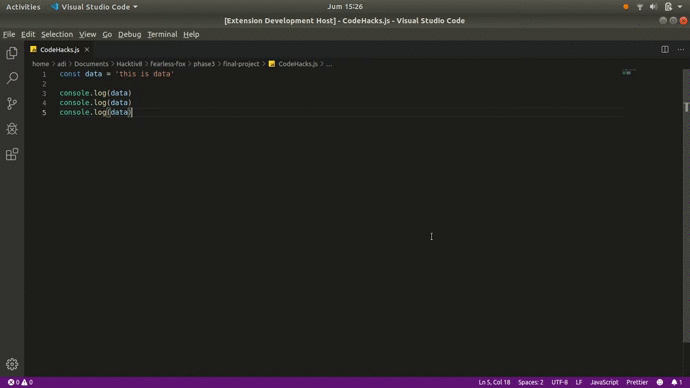

# Code Hacks

## Intro

This extension will help you clean your `JavaScript` code from dummy console.log, creating you a console.log by blocking the lines, run a function etc, installing dependencies just by require it on your code etc.

Here is the direct link to our website 
And Here is the direct link to marketplace

## Features

<ul>
  <li>Delete dummy console.log to clean your code</li>
  <li>Generate a console.log on your code by blocking the lines</li>
  <li>Installing dependencies just by require it on your code</li>
  <li>Runing a selected function just by block it</li>
  <li>Comment all console.log</li>
  <li>Uncomment all console.log</li>
</ul>

## Usage

### Delete dummy console.log
  <ul>
    <li>Use shotcut `CTRL + SHIFT + P`</li> 
    <li>Then input `Delete log` and press enter or click on the suggestion</li>
  </li>
  

## Extension Settings

Include if your extension adds any VS Code settings through the `contributes.configuration` extension point.

For example:

This extension contributes the following settings:

* `myExtension.enable`: enable/disable this extension
* `myExtension.thing`: set to `blah` to do something

## Known Issues

Calling out known issues can help limit users opening duplicate issues against your extension.

## Release Notes

Users appreciate release notes as you update your extension.

### 1.0.0

Initial release of ...

### 1.0.1

Fixed issue #.

### 1.1.0

Added features X, Y, and Z.

-----------------------------------------------------------------------------------------------------------

## Working with Markdown

**Note:** You can author your README using Visual Studio Code.  Here are some useful editor keyboard shortcuts:

* Split the editor (`Cmd+\` on macOS or `Ctrl+\` on Windows and Linux)
* Toggle preview (`Shift+CMD+V` on macOS or `Shift+Ctrl+V` on Windows and Linux)
* Press `Ctrl+Space` (Windows, Linux) or `Cmd+Space` (macOS) to see a list of Markdown snippets

### For more information

* [Visual Studio Code's Markdown Support](http://code.visualstudio.com/docs/languages/markdown)
* [Markdown Syntax Reference](https://help.github.com/articles/markdown-basics/)

**Enjoy!**
