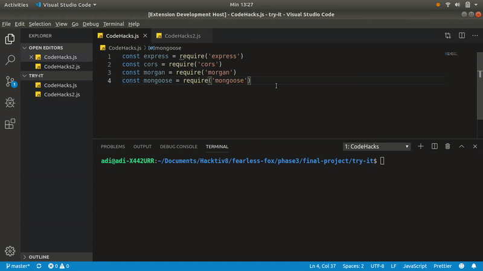
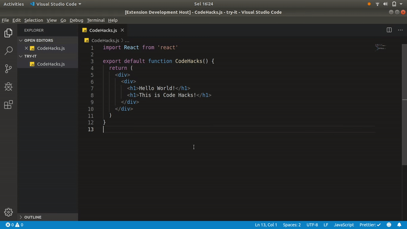
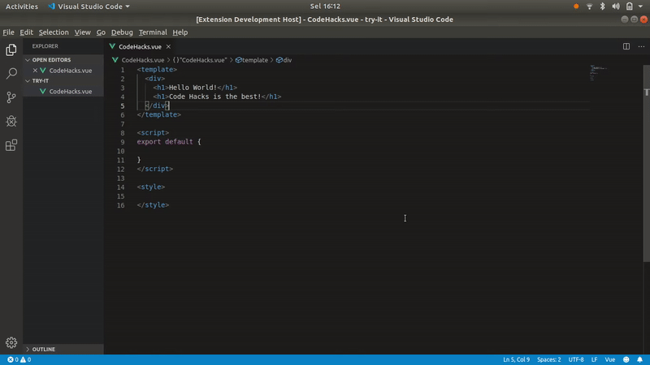
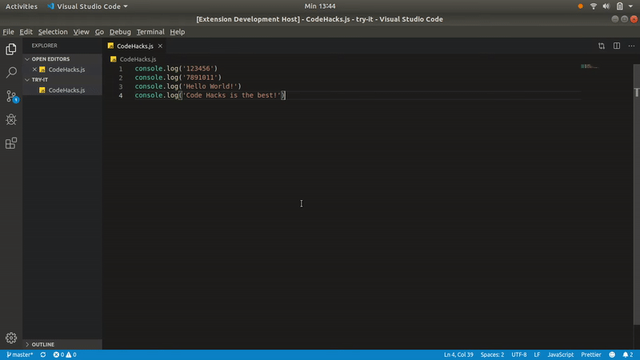
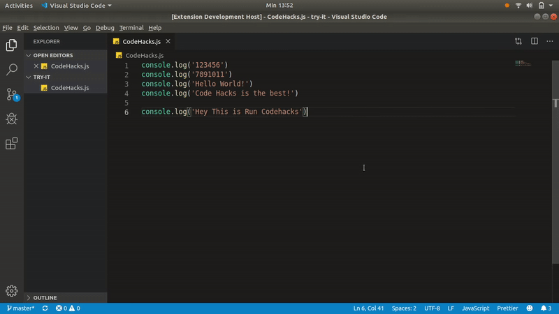
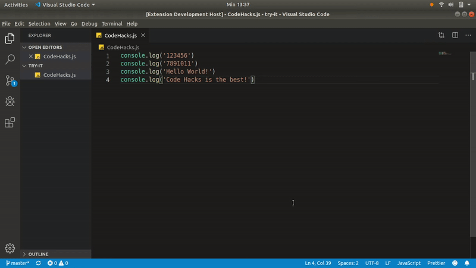

# Code Hacks

## Intro

Codehacks is a VS Code Extension that converts what may have otherwise be a boring or tedious task for most developers into simple commands. With Codehacks you can   automatically install required/imported dependencies in a file, split React/Vue components into separate files, run highlighted code/functions, and use shortcuts/snippets to console.log a variable, comment/uncomment/delete console.logs.

Here is the direct link to our website  
And Here is the direct link to marketplace

## Instalation
Install Through VS Code Extensions. Search for `Code Hacks`

## Features

<ul>
  <li>Installing dependencies just by require/import it on your code</li>
  <li>Make React Component just by block/highlight the codes</li>
  <li>Delete dummy log to clean your code</li>
  <li>Generate a log on your code by blocking the lines</li>
  <li>Runing a selected function just by block it</li>
  <li>Comment all log</li>
  <li>Uncomment all log</li>
</ul>

## Usage

### Install Dependencies
  <ul>  
    <li>Use shortcut CTRL + SHIFT + P</li> 
    <li>Then input Install Dependencies and press enter or click on the suggestion</li>
    <li>Or you can just use shortcut CTRL + ALT + 8</li>
  </ul>

  

 
 

### Make Component React
  <ul>
    <li>Block/Highlight the code that you want change to be component</li>  
    <li>Use shortcut CTRL + SHIFT + P</li> 
    <li>Then input Make Component and press enter or click on the suggestion</li>
    <li>Input the component name then press enter</li>
    <li>Or you can just use shortcut CTRL + ALT + '</li>
  </ul>

  

 
 

### Make Component Vue
  <ul>
    <li>Block/Highlight the code that you want change to be component</li>  
    <li>Use shortcut CTRL + SHIFT + P</li> 
    <li>Then input Make Component and press enter or click on the suggestion</li>
    <li>Input the component name then press enter</li>
    <li>Or you can just use shortcut CTRL + ALT + V</li>
  </ul>

  

 
 

### Delete Log
  <ul>
    <li>Use shortcut CTRL + SHIFT + P</li> 
    <li>Then input Delete log and press enter or click on the suggestion</li>
    <li>Or you can just use shortcut CTRL + ALT + i</li>
  </ul>
  

### Run a code
  <ul>
    <li>Block/Highlight the code/function that you wants to run</li>
    <li>Use shortcut CTRL + SHIFT + P</li> 
    <li>Then input Run Code Hacks and press enter or click on the suggestion</li>    
    <li>Or you can just use shortcut CTRL + ALT + 7</li>
  </ul>

  
  
 
 

### Comment Log & Uncomment Log
  <ul>  
    <li>Use shortcut CTRL + SHIFT + P</li> 
    <li>Then input Comment Log to comment log or input Uncomment Log to uncomment all log and press enter or click on the suggestion</li>
    <li>Or you can just use shortcut CTRL + ALT + 0 to commment all logs and CTRL + ALT + 9 to uncomment all logs</li>
  </ul>

  